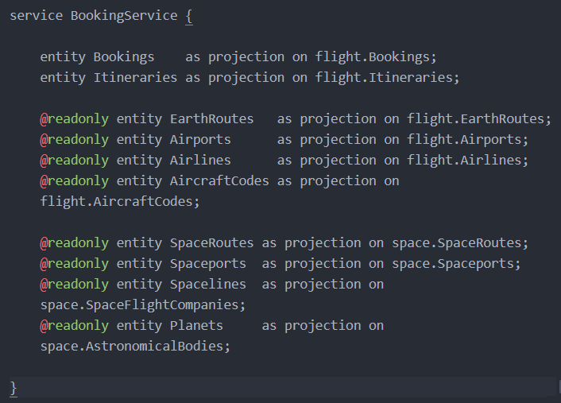
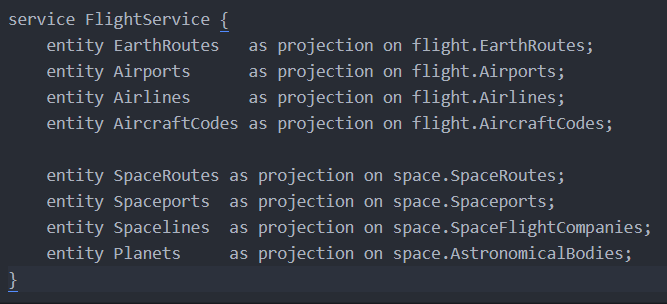
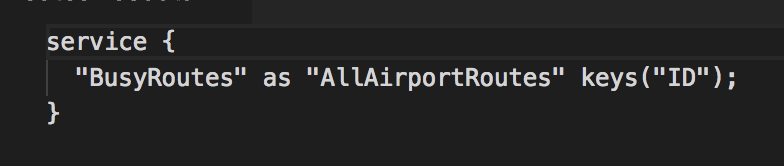
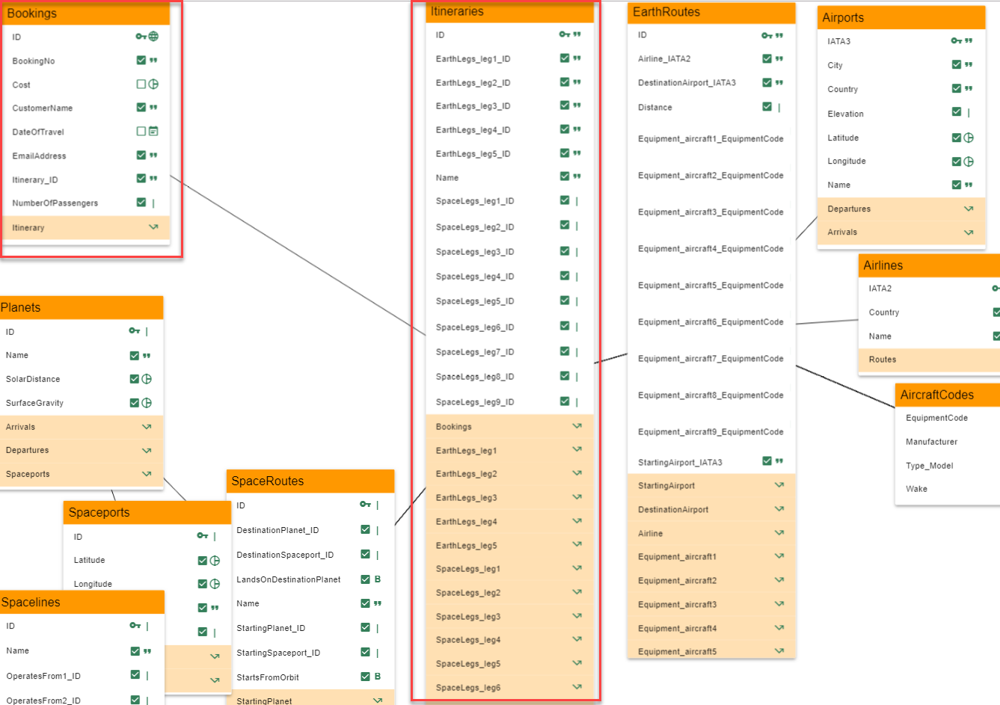
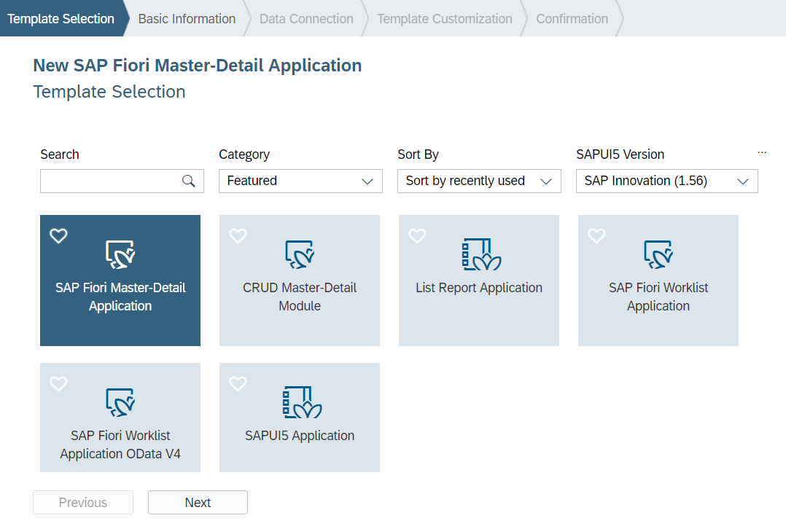

<table width=100% border=>
<tr><td colspan=2><h1>EXERCISE02 - Access available backend services and get an overview of the UI that needs to be developed</h1></td></tr>
<tr><td><h3>SAP TechEd 2018 - CNA462</h3></td><td><h1> &nbsp;10 mins</h1></td></tr>
</table>

## Description
In this exercise, you will

* See the various backend services available
* Access these services in the browser
* Get an overview of the UI that needs to be developed
* See the SAP Web IDE templates that needs to be used to build the UI

## Target group

* UI Developers
* Architects
* UX designers

## Goal

The goal of this exercise is to go through the various backend oData services available that can be consumed from the front end. And also to get an overview of the UI that needs to be developed.

## Prerequisites
  
Here below are prerequisites for this exercise.

* Completed Exercise01

## Steps

1. [Available Services](#services-to-use)
1. [View the Services in a browser](#view-services-in-a-browser)
1. [Overview of the UI](#web-ide-template-for-building-ui)

###  Available Services
We will use the following services to build UI

* Services provided by Java (oData v2)
	- BookingService
	- FlightService
	
* Service provided by node.js module (oData v2)
	- XS OData exposing a Calculation view of Busy Routes

	**Booking Service** (Java)  
	CRUD on Bookings and Itineraries
 	

	**Flight Service** (Java)  
 	
	

	**XS OData** (nodejs)  
	XS OData service exposing Calculation View for Busy Routes
	
	
	

Below is a small preview of the BookingService from the Java layer:

###  View the services in a browser
	
1. Open your browser and check this [link](https://teched2018-cna462-dev-srv.cfapps.eu10.hana.ondemand.com/odata/v2/BookingService/$metadata) to view the booking service from Java. You can also look at all the bookings by going [here](https://teched2018-cna462-dev-srv.cfapps.eu10.hana.ondemand.com/odata/v2/BookingService/Bookings)

1. Open your browser and check this [link](https://teched2018-cna462-dev-nodejs.cfapps.eu10.hana.ondemand.com/xsodata/allRoutes.xsodata/AllAirportRoutes?$top=20) to view the XS OData service from node

###  Overview of the UI

1. We will build UI for the Booking Agent who can,
* Check all the Bookings for space travel and the respective itineraries. 
* Add a new Customer
* Add a new Booking
* View Busy Route Dashboard

	
		

### Summary
This concludes the exercise. You should have learned how to access various oData services available and know the kind of UI that needs to be developed.

Proceed with [next exercise](/./Exercise03/Exercise03.md).