<table width=100% border=>
<tr><td colspan=2><h1>EXERCISE03 - Consume Java Service to Create the Bookings UI for Travel Agency</h1></td></tr>
<tr><td><h3>SAP TechEd 2018 - CNA462</h3></td><td><h1> &nbsp;30 min</h1></td></tr>
</table>


## Description
In this exercise, you’ll learn

* To create a SAP Fiori Master-Detail Application in Web IDE to view a list of Space travel bookings with customers and itinerary information.


## Target group

* Developers
* UI Developers


## Goal

The goal of this exercise is to create a UI for Space Travel Agent and will display the available list of bookings for space travel


## Prerequisites

Prerequisites for this exercise are given below.

* Ensure you have completed Exercise01 and Exercise02


## Steps

1. [Create a project](#create-a-project)
1. [Modify the Detail View](#modigy-detail-view)
1. [Modify the itinerary information](#itinerary-view)

### <a name="create-a-project"></a> Create a new application with the Fiori Master-Detail template
Create a new application project from SAP Web IDE Full-Stack using Fiori Master-Detail template.

1. In the welcome page of SAP Web IDE, click on **New Project from Template** icon.

	

1. Choose the category "SAP Fiori Application".  Click on **SAP Fiori Master-Detail Application** tile and click **Next**.

	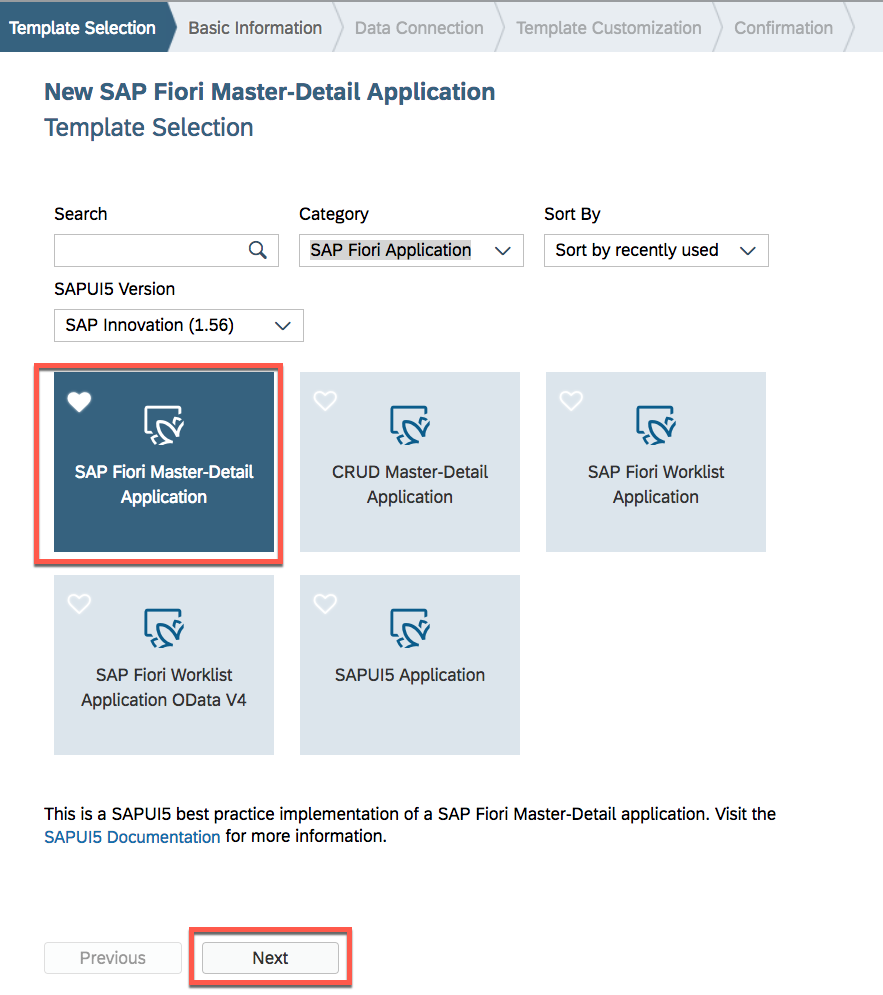

1. Enter the following:

  	
  	| Parameter | Value | Comments  |
	| --------- | ----------- | ----------- |
	| Project Name    | **spacetravelagencyXX** |(where **XX** is your workstation ID)       |
	| Title  | **SPICY Space Travel Agency XX** |(where **XX** is your workstation ID) |
	| Namespace | **com.sap.teched** |   |
  	| Description | **SPICY Space Travel Agency XX** | (where **XX** is your workstation ID) |    
  	
  	
  	and click **Next**.  

	
   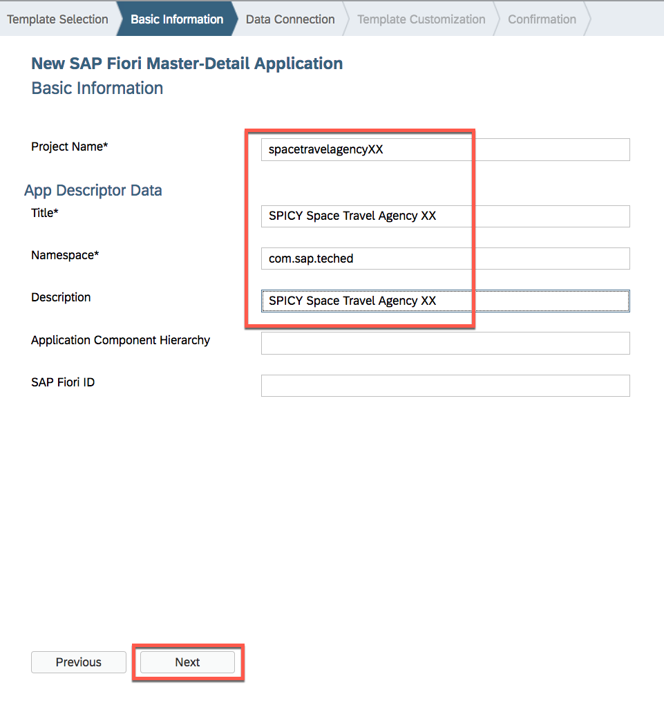
	
1. On the Data Connection screen select **Service URL** from the Sources. Choose **462-462** from dropdown for system. Enter ```/odata/v2/BookingService``` for the path and click **Test**.

	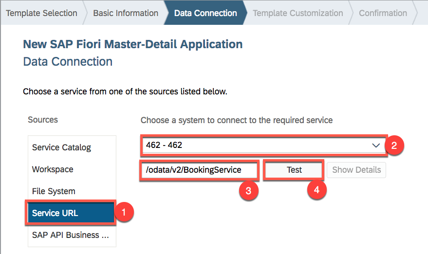
	
1. You should now see the entities in Booking Service. Click **Next**  

	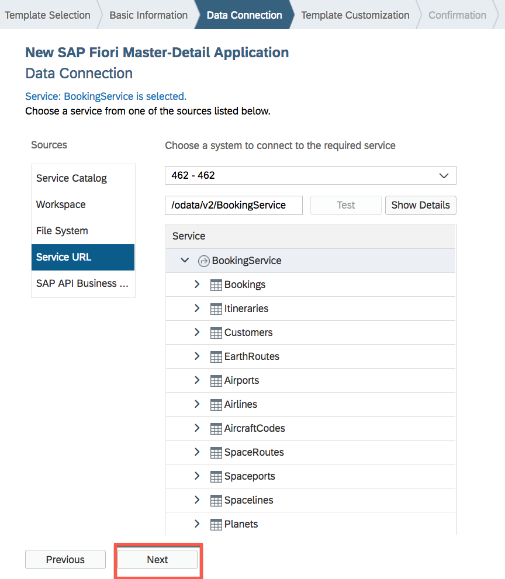
	
1. Enter the following for Application Scenario, Data Binding - Object, Data Binding - Line Item information.

  	| Section | Parameter | Value | 
	| --------- | ----------- | ----------- | 
	| Application Scenario|App Type\*| **Standalone App (optimized for individual deployment)** |
	| Data Binding - Object | Object Collection\*  | **Bookings** |
	|  | Object Collection ID\* | **ID** |   
  	|  | Object Title\* | **BookingNo** |  
  	|  | Object Numeric Attribute | **Cost** |   
  	|  | Object Unit Measure | **DateOfTravel** |  
  	| Data Binding - Line Item | Line Item Collection | **Customer** |   
  	|  | Line Item Collection ID | **ID** |   
  	|  | Line Item Title | **CustomerName** |   
  	|  | Line Item Numeric Attribute | **Age** | 
  	|  | Line Item Unit of Measure | **EmailAddress** |    
  	
  	
  	Click **Finish**.  

   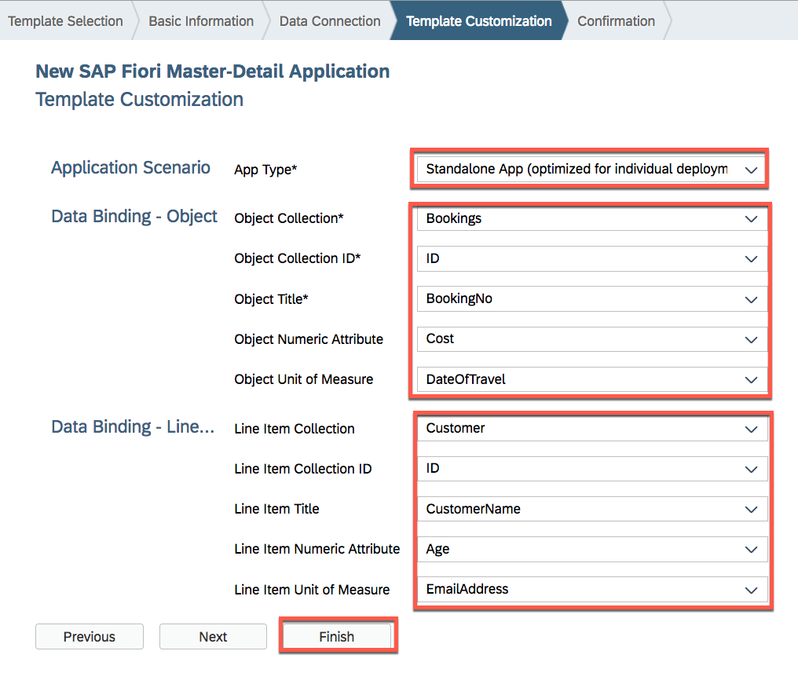
	
1. After the project's creation, you should find the **spacetravelagencyXX** folder in the directory. Expand the webapp folder. Click on **index.html** file.  Then, click on **run** button.

	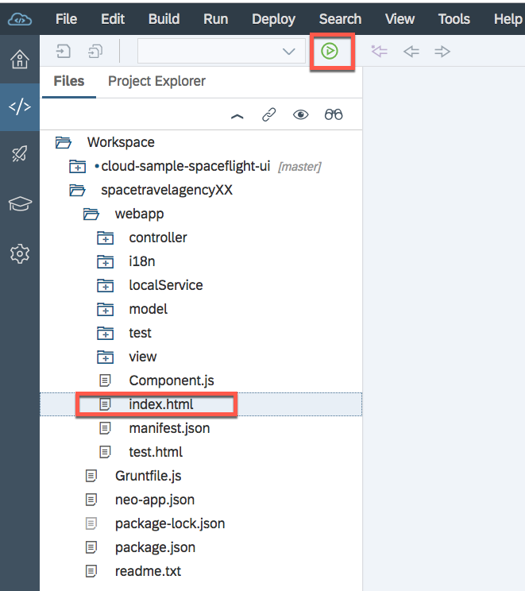
	
1. You should now be able to see the list of bookings. Select one of the bookings by clicking on it.

	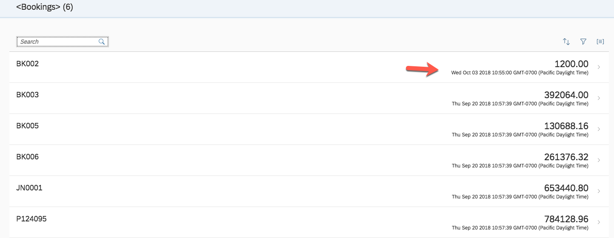
	
1. If you get an error. **Close** the window. *Note*: this error will be fixed in subsequent exercises. 

	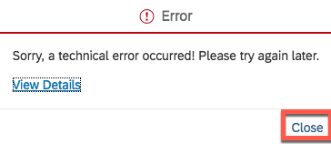
	
1. You Bookings Detailed view should look like this.

	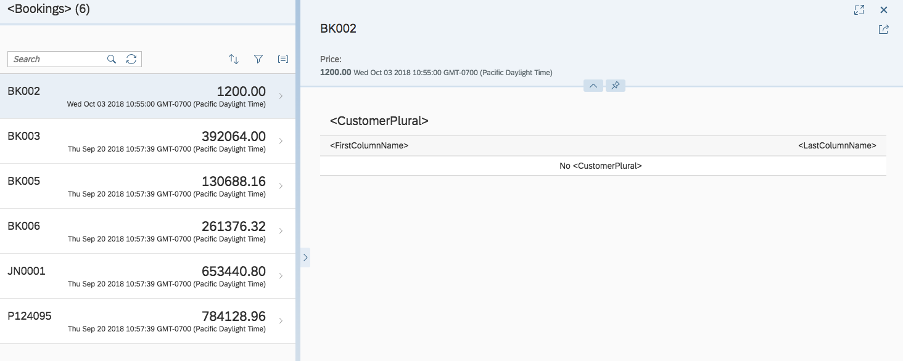
	
Take a little breath. Look around your self. Other participants are also working. Nice. Let's carry on.

### <a name="modigy-detail-view"></a> Modify the Detail View
This Detailed view is kind of empty. Let's modify to show booking information with Customer tab and Itinerary tab.
	
1. Expand the folder under webapp > view. Double click on the *Detail.view.xml* file to open it in the editor.

	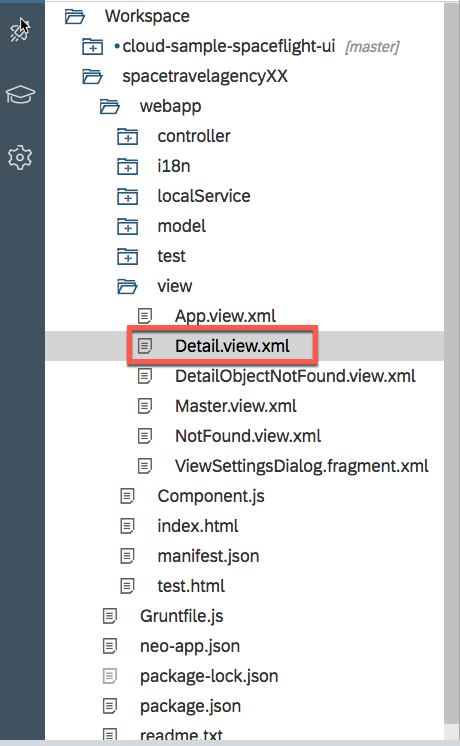

1. Replace the entire content with the following:

	```
	<mvc:View controllerName="com.sap.teched.spacetravelagencyXX.controller.Detail" xmlns="sap.m" xmlns:mvc="sap.ui.core.mvc" xmlns:l="sap.ui.layout" xmlns:form="sap.ui.layout.form"  xmlns:core="sap.ui.core"
		xmlns:semantic="sap.f.semantic">
		
		<Page showHeader="false">
			<content>
				<ObjectHeader id="oh1" responsive="true" fullScreenOptimized="false" title="Booking ID: {BookingNo}" backgroundDesign="Solid">
					<statuses>
						<ObjectStatus title="Customer Name" text="{Customer/CustomerName}"/>
						<ObjectStatus title="Number Of Passengers" text="{NumberOfPassengers}" state="Success"/>
						<ObjectStatus title="Departure" text="{ path: 'DateOfTravel', formatter: '.formatter.dateFormat' }" state="None"/>
						<ObjectStatus title="Ticket Price" text="{Cost} USD" state="Error"/>
					</statuses>
					<headerContainer>
						<IconTabBar id="itb1" selectedKey="key3" upperCase="true" class="sapUiResponsiveContentPadding">
							<items>
								<IconTabFilter text="Customer" icon="sap-icon://customer" key="key3">
									<content>
										<VBox class="sapUiSmallMargin">
											<form:SimpleForm id="cutomerDataForm" editable="false" maxContainerCols="2" layout="ResponsiveGridLayout" title="Customer Details"
												labelSpanXL="4" labelSpanL="4" labelSpanM="12" labelSpanS="12" adjustLabelSpan="false" emptySpanXL="0" emptySpanL="0" emptySpanM="0"
												emptySpanS="0" columnsXL="2" columnsL="2" columnsM="2" singleContainerFullSize="false">
												<form:content>
													<core:Title text="Personal Information"/>
													<Label text="E-mail"/>
													<Text text="{Customer/EmailAddress}"/>
													<Label text="Age"/>
													<Text text="{Customer/Age}"/>
													<Label text="Gender"/>
													<Text text="{Customer/Gender}"/>
													<Label text="Passport No."/>
													<Text text="{Customer/PassportNumber}"/>
													<Label text="Nationality"/>
													<Text text="{Customer/Nationality}"/>
													<Label text="Contact No."/>
													<Text text="{Customer/Phone}"/>
													<Label text="Address"/>
													<Text text="{Customer/Address}"/>
													<core:Title text="Travel Information"/>
													<Label text="Class"/>
													<Text text="{Class}"/>
													<Label text="Meal"/>
													<Text text="{Meal}"/>
												</form:content>
											</form:SimpleForm>
										</VBox>
									</content>
								</IconTabFilter>
								<IconTabFilter text="Itinerary" icon="sap-icon://travel-itinerary" key="key1">
									<content>
										<Table id="earthRoutesTable" inset="false" items="{ path: 'earthRoutes>/EarthRoutes'}">
											<headerToolbar>
												<Toolbar>
													<Title text="{Itinerary/Name}" level="H1"/>
												</Toolbar>
											</headerToolbar>
											<infoToolbar>
												<Toolbar active="true">
													<Label text="Earth Routes"/>
												</Toolbar>
											</infoToolbar>
											<columns>
												<Column minScreenWidth="Desktop" hAlign="Center">
													<Text text="Origin"/>
												</Column>
												<Column minScreenWidth="Desktop" demandPopin="true" hAlign="Center">
													<Text text="Destination"/>
												</Column>
												<Column minScreenWidth="Desktop" demandPopin="true" hAlign="Center">
													<Text text="Distance"/>
												</Column>
											</columns>
											<items>
												<ColumnListItem>
													<cells>
														<ObjectIdentifier title="{earthRoutes>Origin}" text=""/>
														<Text text="{earthRoutes>Destination}"/>
														<Text text="{earthRoutes>Duration}"/>
													</cells>
												</ColumnListItem>
											</items>
										</Table>
										<Table id="spaceRoutesTable" inset="false" items="{ path: 'spaceRoutes>/SpaceRoutes'}">
											<infoToolbar>
												<Toolbar active="true">
													<Label text="Space Routes"/>
												</Toolbar>
											</infoToolbar>
											<columns>
												<Column minScreenWidth="Desktop" hAlign="Center">
													<Text text="SpaceLeg"/>
												</Column>
												<Column minScreenWidth="Desktop" demandPopin="true" hAlign="Center">
													<Text text="Activity"/>
												</Column>
												<Column minScreenWidth="Desktop" demandPopin="true" hAlign="Center">
													<Text text="Distance"/>
												</Column>
											</columns>
											<items>
												<ColumnListItem>
													<cells>
														<!-- visible="{= ${fieldName} !== ‘’}-->
														<ObjectIdentifier title="{spaceRoutes>SpaceLeg}" text=""/>
														<Text text="{spaceRoutes>Activity}"/>
														<Text text="{spaceRoutes>Duration}"/>
													</cells>
												</ColumnListItem>
											</items>
										</Table>
									</content>
								</IconTabFilter>
							</items>
						</IconTabBar>
					</headerContainer>
				</ObjectHeader>
			</content>
		</Page>
	</mvc:View>
	```
  	
1. Make sure you replace the **XX** text with your workstation ID. Press *\<Ctrl\>+f*. Search for **spacetravelagencyXX**. Replace **XX** text with your workstation ID, for example: **spacetravelagency88**.  

1. Beautify the file format by right click on the editor.  Then, selcet **Beautify**.

	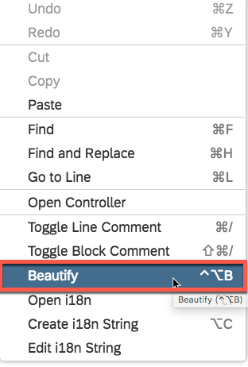
	
1. **Save** the file.

	
	
1. The Detail View has been modified.

	
	
1. Now, we need to extend the items to show on Detail View from the Master view.  Open the **Master.view.xml** file by double clicking on it. 

1. Beautify the file format by right click on the editor.  Then, selcet **Beautify**.

	

1. Replace the *items* with the following code:

	```
	items="{ path: '/Bookings', parameters: {expand: 'Customer,Itinerary' },sorter: { path: 'BookingNo', descending: false }, groupHeaderFactory: '.createGroupHeader' }"
	```

	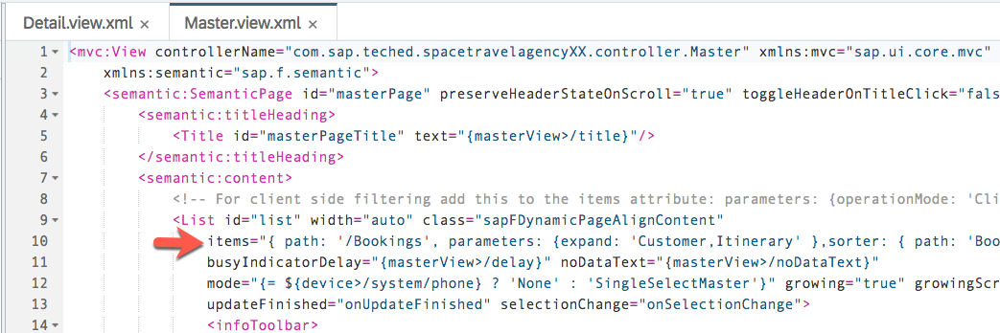

1. **Save** the file.

	
	
1. Run the preview.

	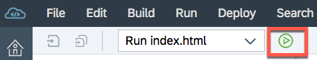
	
1. You should see the booking detail view with customer and itinerary tabs.

	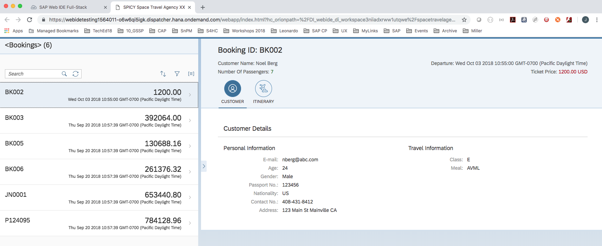
	
1. Further modification will be done for the itinerary tab later. 

	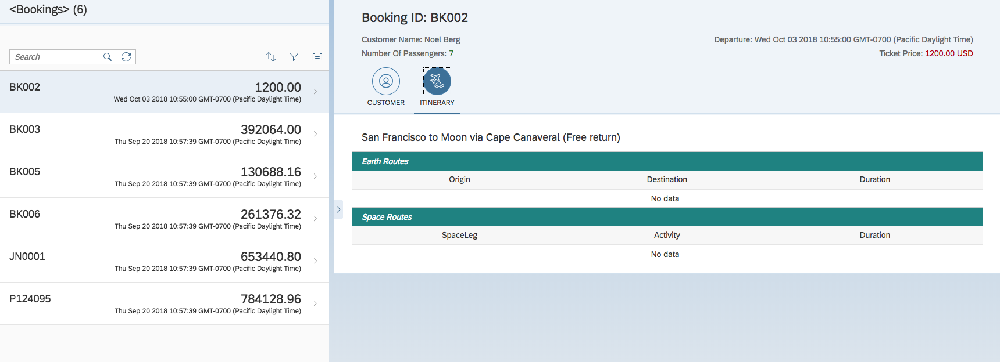

### <a name="itinerary-view"></a> Modify the itinerary information
Let's fix the itinerary information.

1. Open the **Detail.controller.js** file.

	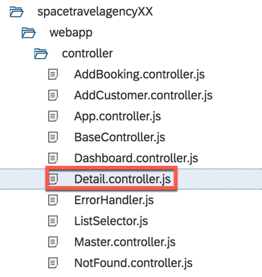

1. Replace the **onInit** function with following codes.

	```
		onInit: function () {
			// Model used to manipulate control states. The chosen values make sure,
			// detail page is busy indication immediately so there is no break in
			// between the busy indication for loading the view's meta data
			var oViewModel = new JSONModel({
				busy: false,
				delay: 0,
				lineItemListTitle: this.getResourceBundle().getText("detailLineItemTableHeading")
			});
			
			var oEarthRouteModel = new JSONModel({
				EarthRoutes : []
			});
			
			var oSpaceRouteModel = new JSONModel({
				 SpaceRoutes : []
			});

			this.getRouter().getRoute("object").attachPatternMatched(this._onObjectMatched, this);

			this.setModel(oViewModel, "detailView");
			this.setModel(oEarthRouteModel, "earthRoutes");
			this.setModel(oSpaceRouteModel, "spaceRoutes");

			this.getOwnerComponent().getModel().metadataLoaded().then(this._onMetadataLoaded.bind(this));
		},
	```

	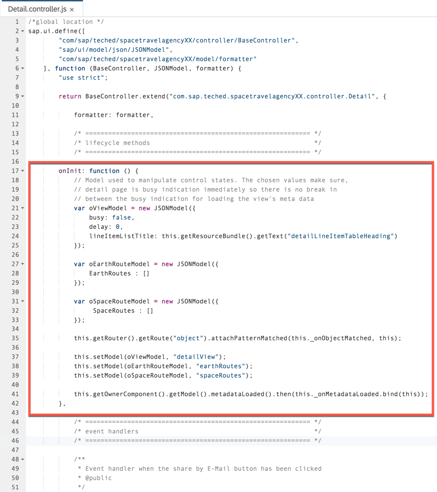

1. Replace the **_bindView** function with following codes.

	```
			_bindView: function (sObjectPath) {
			// Set busy indicator during view binding
			var oViewModel = this.getModel("detailView");

			// If the view was not bound yet its not busy, only if the binding requests data it is set to busy again
			oViewModel.setProperty("/busy", false);
			
			this.getView().bindElement({
				path: sObjectPath,
				events: {
					change: this._onBindingChange.bind(this),
					dataRequested: function () {
						oViewModel.setProperty("/busy", true);
					},
					dataReceived: function () {
						oViewModel.setProperty("/busy", false);
					}
				}
			});
			
			//get data for routes
			var that = this;
			var sItineraryPath = sObjectPath + "/Itinerary";
			
			if(this.getView().getModel().getProperty(sItineraryPath)){
				this._prepareRoutesModel(sItineraryPath);
			}else{
				this.getView().bindElement({
				path: sObjectPath + "/Itinerary",
				events: {
					dataReceived: function () {
						jQuery.proxy(that._prepareRoutesModel(sItineraryPath),this);
					}
				}
			});
			}
			
		},
		
		_prepareRoutesModel: function(sItineraryPath){
			var oBookingModel = this.getView().getModel();
			var oItineraryDetails = oBookingModel.getProperty(sItineraryPath);
			
			if(!oItineraryDetails){
				return;
			}
			
			var sItineraryID = oItineraryDetails.ID;
			
			var aEarthLegRouteNames = [
				{
					ID: "EarthLegs_leg1_ID",
					path: "EarthLegs_leg1"
				},
				{
					ID: "EarthLegs_leg2_ID",
					path: "EarthLegs_leg2"
				},
				{
					ID: "EarthLegs_leg3_ID",
					path: "EarthLegs_leg3"	
				},
				{
					ID: "EarthLegs_leg4_ID",
					path: "EarthLegs_leg4"
				},
				{
					ID: "EarthLegs_leg5_ID",
					path: "EarthLegs_leg5"
				}];
				
			var aSpaceLegRouteNames = [
				{
					ID: "SpaceLegs_leg1_ID",
					path: "SpaceLegs_leg1"
				},
				{
					ID: "SpaceLegs_leg2_ID",
					path: "SpaceLegs_leg2"
				},
				{
					ID: "SpaceLegs_leg3_ID",
					path: "SpaceLegs_leg3"	
				},
				{
					ID: "SpaceLegs_leg4_ID",
					path: "SpaceLegs_leg4"
				},
				{
					ID: "SpaceLegs_leg5_ID",
					path: "SpaceLegs_leg5"
				},
				{
					ID: "SpaceLegs_leg6_ID",
					path: "SpaceLegs_leg6"
				},
				{
					ID: "SpaceLegs_leg7_ID",
					path: "SpaceLegs_leg7"
				},
				{
					ID: "SpaceLegs_leg8_ID",
					path: "SpaceLegs_leg8"
				},
				{
					ID: "SpaceLegs_leg9_ID",
					path: "SpaceLegs_leg9"
				}
				];
				
			oBookingModel.setDeferredGroups(["earthRoutesGroup","spaceRoutesGroup"]);
			
			for(var i = 0 ; i < aEarthLegRouteNames.length; i++){
				if(oItineraryDetails[aEarthLegRouteNames[i].ID] !== null){
					oBookingModel.read("/Itineraries('"+ sItineraryID + "')/" + aEarthLegRouteNames[i].path,{groupId:"earthRoutesGroup"});
				}
			}
			
			for(i = 0 ; i < aSpaceLegRouteNames.length; i++){
				if(oItineraryDetails[aSpaceLegRouteNames[i].ID] !== null){
					oBookingModel.read("/Itineraries('"+ sItineraryID + "')/" + aSpaceLegRouteNames[i].path,{groupId:"spaceRoutesGroup"});
				}
			}
			
			oBookingModel.submitChanges({groudId:"earthRoutesGroup", error: this._fnError, success:jQuery.proxy(this._transformRoutesData,this)});
			oBookingModel.submitChanges({groudId:"spaceRoutesGroup", error: this._fnError, success:jQuery.proxy(this._transformRoutesData,this)});
		},
		
		_transformRoutesData: function(oResponse) {
			var aResponses = oResponse.__batchResponses;
			var aEarthLegs = [];
			var aSpaceLegs = [];
			
			var isEarthLegResponse = false;
			var isSpaceLegResponse = false;
			
			
			var oEarthRouteModel = this.getView().getModel("earthRoutes");
			var oSpaceRouteModel = this.getView().getModel("spaceRoutes");
			
			
			for(var i= 0 ; i < aResponses.length ; i++){
				if(aResponses[i].data && aResponses[i].data.StartingAirport_IATA3){
					//earth leg route
					aEarthLegs.push({
						"Origin" : aResponses[i].data.StartingAirport_IATA3,
						"Destination" : aResponses[i].data.DestinationAirport_IATA3,
						"Duration" : aResponses[i].data.Distance
					});
					isEarthLegResponse = true;
				}
				
				if(aResponses[i].data && aResponses[i].data.StartingPlanet){
					//space leg route
					aSpaceLegs.push({
						"SpaceLeg" : aResponses[i].data.Name
					});
					isSpaceLegResponse = true;
				}
			}
			
			if(isEarthLegResponse){
				oEarthRouteModel.setData({EarthRoutes : aEarthLegs});
			}
			
			if(isSpaceLegResponse){
				oSpaceRouteModel.setData({SpaceRoutes : aSpaceLegs});
			}
		},
		
		_fnError: function() {
			sap.m.MessageToast.show("Error occured while fetching Routes");
		},
	```

	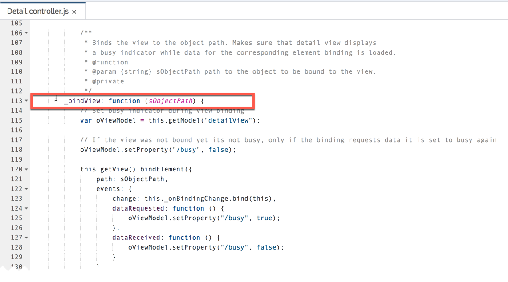
	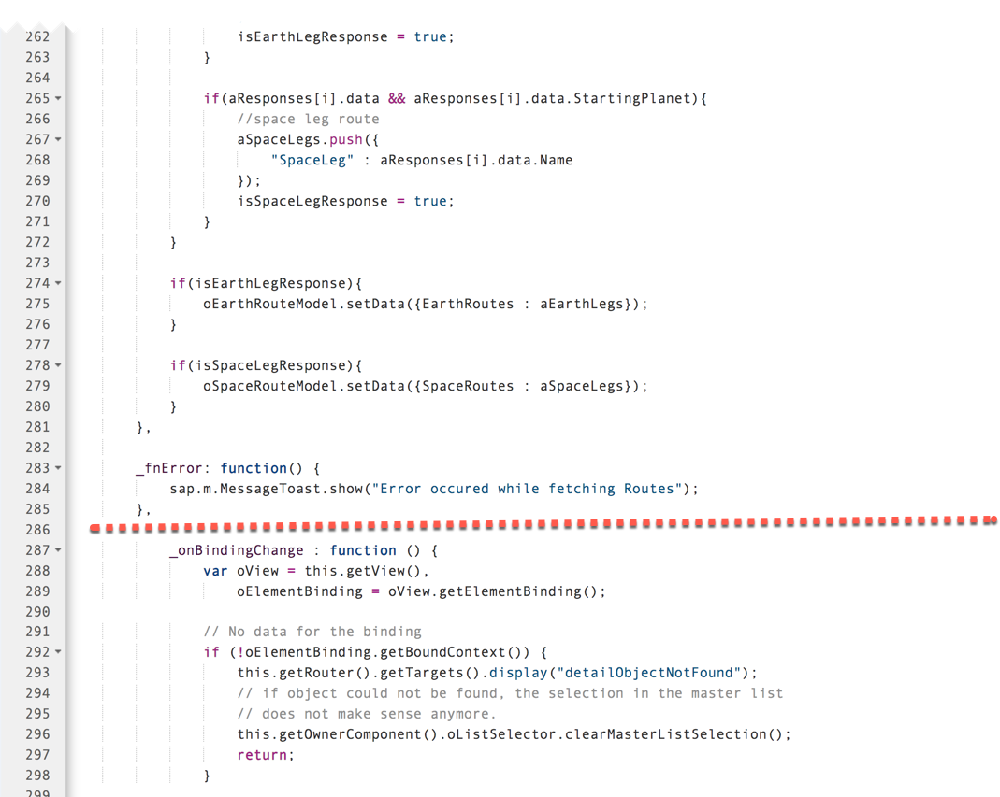

1. **Save** the file.

	

1. Run the preview.

	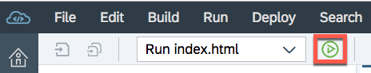

1. You should see the Customer information.

	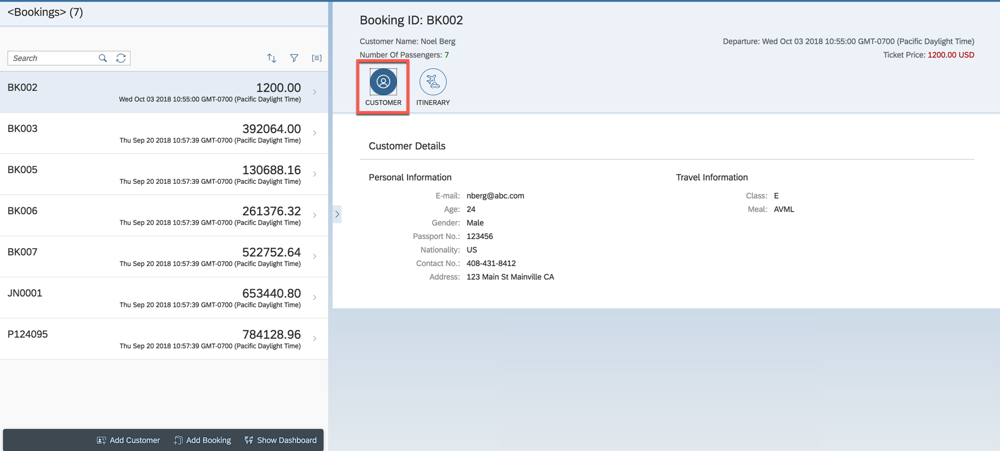

1. Click on the **ITINERARY** tab. You should see the data has been pulled in.

	


## Summary
This concludes the exercise. Now you how to create a SAP Fiori Master-Detail application. Add the Customer, booking, and itinerary views by consuming the Java Service. 

Proceed with [next exercise](/././_excercise_/Exercise04/Exercise04.md).
