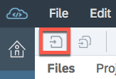

<table width=100% border=>
<tr><td colspan=2><h1>EXERCISE04 - Consume Java Service to Enhance the Bookings UI for Travel Agency</h1></td></tr>
<tr><td><h3>SAP TechEd 2018 - CNA462</h3></td><td><h1> &nbsp;30 min</h1></td></tr>
</table>


## Description
In this exercise, you’ll learn

* To enhance Space travel bookings with Add Customers and Add Bookings screens.


## Target group

* Developers
* UI Developers


## Goal

The goal of this exercise is to enhance the Bookings UI for Space Travel Agent to add customers and bookings information.

## Prerequisites

Here below are prerequisites for this exercise.

* Ensure you have completed Exercise01, Exercise02, and Exercise03.


## Steps

1. [Add Customers View](#add-customer)
1. [Add Bookings View](#add-booking)

### <a name="add-customer"></a> Add Customers View
Let's enable application to be able to add customers information. Before we add the views for customers and booking we need a way to access these new yet ot be added screens. For that we will add buttons in a footer.
	
1. We would like to add the buttons on the footer area of the Master View. Open the **Master.view.xml** file by double clicking on it. 

	

1. Add the following codes for the buttons on the footer area after the end tag  **\</semantic:content>** at the bottom of the file.

	```
	<semantic:footerCustomActions>
		<Button icon="sap-icon://add-contact" text="Add Customer" press="action"
			xmlns:action="http://schemas.sap.com/sapui5/extension/sap.ui.core.CustomData/1"
			action:wiring="\{'press':\{'navigation':\{'routeName':'AddCustomer'\}\}\}"/>
		<Button icon="sap-icon://add-coursebook" text="Add Booking"  press="action"
			xmlns:action="http://schemas.sap.com/sapui5/extension/sap.ui.core.CustomData/1"
			action:wiring="\{'press':\{'navigation':\{'routeName':'AddBooking'\}\}\}"/>
		<Button icon="sap-icon://geographic-bubble-chart" text="Show Dashboard" press="action"
			xmlns:action="http://schemas.sap.com/sapui5/extension/sap.ui.core.CustomData/1"
			action:wiring="\{'press':\{'navigation':\{'routeName':'Dashboard'\}\}\}"/>
	</semantic:footerCustomActions>
	```
	
	
	

1. We need to show the footer on the page with *showFooter="true"*.  Replace the SemanticPage line with the following code.

	```
	<semantic:SemanticPage id="masterPage" preserveHeaderStateOnScroll="true" toggleHeaderOnTitleClick="false" showFooter="true">
	```
	
	

1. **Save** the file.

	

1. Run the preview.

	
		
1. Good. We see the buttons showing on the footer area. 

	
	
1. Next, we will add the Customer view.  Righ click on the *webapp > view* folder. Select *New > SAPUI5 View*.

	
	
1. Type in ```AddCustomer``` for the View Name.  Click on **Next**.

	

1. Click on **Finish**.

	

1. Open **AddCustomer.view.xml** file. Replace with the following codes for the file.

	```
	<mvc:View xmlns:core="sap.ui.core" xmlns:mvc="sap.ui.core.mvc"  xmlns="sap.m" xmlns:l="sap.ui.layout" xmlns:f="sap.ui.layout.form"
		controllerName="com.sap.teched.spacetravelagencyXX.controller.AddCustomer" xmlns:html="http://www.w3.org/1999/xhtml">
		<App>
			<pages>
				<Page title="Create New Customer">
					<content>
						<VBox class="sapUiSmallMargin">
							<f:Form id="FormChange354" minWidth="1024" maxContainerCols="2" editable="true">
								<f:title>
									<core:Title text="Enter Customer Details :"/>
								</f:title>
								<f:layout>
									<f:ResponsiveGridLayout labelSpanL="3" labelSpanM="3" emptySpanL="4" emptySpanM="4" columnsL="1" columnsM="1"/>
								</f:layout>
								<f:formContainers>
									<f:FormContainer>
										<f:formElements>
											<f:FormElement label="Name">
												<f:fields>
													<Input id="nameInput" type="Text"/>
												</f:fields>
											</f:FormElement>
											<f:FormElement label="Age">
												<f:fields>
													<Input id="ageInput" type="Number"/>
												</f:fields>
											</f:FormElement>
											<f:FormElement label="Gender">
												<f:fields>
													<Select width="100%" id="genderSelect">
														<items>
															<core:Item text="Female" key="Female"/>
															<core:Item text="Male" key="Male"/>
															<core:Item text="Others" key="Others"/>
														</items>
													</Select>
												</f:fields>
											</f:FormElement>
											<f:FormElement label="Nationality">
												<f:fields>
													<Input id="nationalityInput" type="Text" placeholder="Enter Nationality..." showSuggestion="true" filterSuggests="true"
														suggestionItems="{nationalities>/Nationalities}">
														<suggestionItems>
															<core:Item text="{nationalities>}"/>
														</suggestionItems>
													</Input>
												</f:fields>
											</f:FormElement>
											<f:FormElement label="Email">
												<f:fields>
													<Input id="emailInput" type="Email"/>
												</f:fields>
											</f:FormElement>
											<f:FormElement label="Contact Number">
												<f:fields>
													<Input id="contactInput" type="Telephone"/>
												</f:fields>
											</f:FormElement>
											<f:FormElement label="Passport Number">
												<f:fields>
													<Input id="passportInput" type="Text"/>
												</f:fields>
											</f:FormElement>
											<f:FormElement label="Address">
												<f:fields>
													<TextArea id="addressInput"/>
												</f:fields>
											</f:FormElement>
										</f:formElements>
									</f:FormContainer>
								</f:formContainers>
							</f:Form>
						</VBox>
					</content>
					<footer>
						<Toolbar>
							<ToolbarSpacer/>
							<Button text="Create" type="Accept" press="createCustomer"/>
							<Button text="Exit" type="Reject" press="goBack"/>
						</Toolbar>
					</footer>
				</Page>
			</pages>
		</App>
	</mvc:View>
	```

1. Make sure you replace the **XX** text with your workstation ID. Press *\<Ctrl\>+f*. Search for **spacetravelagencyXX**. Replace **XX** text with your workstation ID, for example: **spacetravelagency88**. 

1. **Save** the file.

	
	
1. Then, we need to modify the Customer controller file.  Expand the *webapp > controller* folder. Open **AddCustomer.controller.js** file. Replace with the following codes for the file.


	```
	sap.ui.define([
		"sap/ui/core/mvc/Controller",
		"sap/ui/model/json/JSONModel",
		"sap/ui/core/routing/History",
		"sap/ui/model/Filter",
		"sap/ui/model/FilterOperator"
	], function (Controller, JSONModel, History, Filter, FilterOperator) {
		"use strict";
	
		return Controller.extend("com.sap.teched.spacetravelagencyXX.controller.AddCustomer", {
	
			onInit: function () {
				var oModel = new JSONModel();
				oModel.loadData(jQuery.sap.getModulePath("com.sap.teched.spacetravelagencyXX", "/model/nationalities.json"), false);
				this.getView().setModel(oModel, "nationalities");
			},
			createCustomer: function () {
				var oView = this.getView();
				var oModel = oView.getModel();
				var oCustomer = {};
				oCustomer.CustomerName = oView.byId("nameInput").getValue();
				oCustomer.EmailAddress = oView.byId("emailInput").getValue();
				oCustomer.PassportNumber = oView.byId("passportInput").getValue();
				oCustomer.Age = parseInt(oView.byId("ageInput").getValue());
				oCustomer.Gender = oView.byId("genderSelect").getSelectedItem().getText();
				oCustomer.Nationality = oView.byId("nationalityInput").getValue();
				oCustomer.Phone = oView.byId("contactInput").getValue();
				oCustomer.Address = oView.byId("addressInput").getValue();
				oModel.create('/Customers', oCustomer, null, function () {
						sap.m.MessageToast.show("Customer: " + oCustomer.CustomerName+ " Created Succesfully !");
				}, function () {
					sap.m.MessageToast.show("Customer: " + oCustomer.CustomerName+ " Creation Failed !");
				});
				this.goBack();
			},
			goBack: function () {
				var oHistory = History.getInstance();
				var sPreviousHash = oHistory.getPreviousHash();
	
				if (sPreviousHash !== undefined) {
					window.history.go(-1);
				} else {
					var oRouter = sap.ui.core.UIComponent.getRouterFor(this);
					oRouter.navTo("object", true);
				}
			}
		});
	});
	```	  
	
1. Make sure you replace the **XX** text with your workstation ID. Press *\<Ctrl\>+f*. Search for **spacetravelagencyXX**. Replace **XX** text with your workstation ID, for example: **spacetravelagency88**. 

	 

1. **Save** the file.

	
	
1. Now, we need to adjust the **manifest.json** file for the targets, navigation and routes to get Customers information. Open the **manifest.json** file.

	
	
1. On the "Descriptor Editor", click on *Routing* tab.  Click on **AddCustomer** in the *Manage Target* section at the very bottom of the screen.

	
	
1. Enter the following inforamtion:

  	| Parameter | Value | Comments |
	| --------- | ----------- | ----------- | 
	| View Name    | **AddCustomer** |    
	| control Aggregation  | **midColumnPages** | |
	| control ID | **layout** |   |
  	| View Path | **com.sap.teched.spacetravelagencyXX.view** |(where **XX** is your workstation ID)       |   
  	| View Type    | **XML** |    |
  	| Transition   | **slide** |    |
	| Clear Control Aggregation    | **false** |    |
	
	

   
	
1. Click on **+** button in the *Routes* section.  

	
	
1. Add the following:

  	| Parameter | Value | 
	| --------- | ----------- | 
	| Name    | **AddCustomer** |    
	| Pattern  | **AddCustomer** | 
	| Targets | **AddCustomer** |   
	
1. Click on **+** button to add targets.

   
	
1. Select AddCustom from the drop down list.

   
	
1. Click on **OK**.

   

1. Route for AddCustomer added.

	


1. **Save** the file.

	
		
1. Next, we need to add the control on the **Master.controller.js** file. Open the **Master.controller.js** file. 

   

1. Add in the following codes at the end of the file after the *_updateFilterBar : function*.

	```
	,
		
		/**
		 *@memberOf com.sap.teched.spacetravelagency.controller.Master
		 */
		action: function (oEvent) {
			var that = this;
			var actionParameters = JSON.parse(oEvent.getSource().data("wiring").replace(/'/g, "\""));
			var eventType = oEvent.getId();
			var aTargets = actionParameters[eventType].targets || [];
			aTargets.forEach(function (oTarget) {
				var oControl = that.byId(oTarget.id);
				if (oControl) {
					var oParams = {};
					for (var prop in oTarget.parameters) {
						oParams[prop] = oEvent.getParameter(oTarget.parameters[prop]);
					}
					oControl[oTarget.action](oParams);
				}
			});
			var oNavigation = actionParameters[eventType].navigation;
			if (oNavigation) {
				var oParams = {};
				(oNavigation.keys || []).forEach(function (prop) {
					oParams[prop.name] = encodeURIComponent(JSON.stringify({
						value: oEvent.getSource().getBindingContext(oNavigation.model).getProperty(prop.name),
						type: prop.type
					}));
				});
				if (Object.getOwnPropertyNames(oParams).length !== 0) {
					this.getOwnerComponent().getRouter().navTo(oNavigation.routeName, oParams);
				} else {
					this.getOwnerComponent().getRouter().navTo(oNavigation.routeName);
				}
			}
		}
	```

1. Make sure you replace the **XX** text with your workstation ID. Press *\<Ctrl\>+f*. Search for **spacetravelagencyXX**. Replace **XX** text with your workstation ID, for example: **spacetravelagency88**. 		
		
	
	

1. **Save** the file.

	
	
1. We need nationality data for the customer. Right click **webapp > model**. Select **New > File**.

	

1. Type in ```nationalities.json``` for the Target Name.  Click on **OK**.

	

1. Add in the following codes for the file.

	```
	{
		"Nationalities": [
			"Afghan",
			"Albanian",
			"Algerian",
			"American",
			"Andorran",
			"Angolan",
			"Antiguans",
			"Argentinean",
			"Armenian",
			"Australian",
			"Austrian",
			"Azerbaijani",
			"Bahamian",
			"Bahraini",
			"Bangladeshi",
			"Barbadian",
			"Barbudans",
			"Batswana",
			"Belarusian",
			"Belgian",
			"Belizean",
			"Beninese",
			"Bhutanese",
			"Bolivian",
			"Bosnian",
			"Brazilian",
			"British",
			"Bruneian",
			"Bulgarian",
			"Burkinabe",
			"Burmese",
			"Burundian",
			"Cambodian",
			"Cameroonian",
			"Canadian",
			"Cape Verdean",
			"Central African",
			"Chadian",
			"Chilean",
			"Chinese",
			"Colombian",
			"Comoran",
			"Congolese",
			"Costa Rican",
			"Croatian",
			"Cuban",
			"Cypriot",
			"Czech",
			"Danish",
			"Djibouti",
			"Dominican",
			"Dutch",
			"East Timorese",
			"Ecuadorean",
			"Egyptian",
			"Emirian",
			"Equatorial Guinean",
			"Eritrean",
			"Estonian",
			"Ethiopian",
			"Fijian",
			"Filipino",
			"Finnish",
			"French",
			"Gabonese",
			"Gambian",
			"Georgian",
			"German",
			"Ghanaian",
			"Greek",
			"Grenadian",
			"Guatemalan",
			"Guinea-Bissauan",
			"Guinean",
			"Guyanese",
			"Haitian",
			"Herzegovinian",
			"Honduran",
			"Hungarian",
			"I-Kiribati",
			"Icelander",
			"Indian",
			"Indonesian",
			"Iranian",
			"Iraqi",
			"Irish",
			"Israeli",
			"Italian",
			"Ivorian",
			"Jamaican",
			"Japanese",
			"Jordanian",
			"Kazakhstani",
			"Kenyan",
			"Kittian and Nevisian",
			"Kuwaiti",
			"Kyrgyz",
			"Laotian",
			"Latvian",
			"Lebanese",
			"Liberian",
			"Libyan",
			"Liechtensteiner",
			"Lithuanian",
			"Luxembourger",
			"Macedonian",
			"Malagasy",
			"Malawian",
			"Malaysian",
			"Maldivan",
			"Malian",
			"Maltese",
			"Marshallese",
			"Mauritanian",
			"Mauritian",
			"Mexican",
			"Micronesian",
			"Moldovan",
			"Monacan",
			"Mongolian",
			"Moroccan",
			"Mosotho",
			"Motswana",
			"Mozambican",
			"Namibian",
			"Nauruan",
			"Nepalese",
			"New Zealander",
			"Nicaraguan",
			"Nigerian",
			"Nigerien",
			"North Korean",
			"Northern Irish",
			"Norwegian",
			"Omani",
			"Pakistani",
			"Palauan",
			"Panamanian",
			"Papua New Guinean",
			"Paraguayan",
			"Peruvian",
			"Polish",
			"Portuguese",
			"Qatari",
			"Romanian",
			"Russian",
			"Rwandan",
			"Saint Lucian",
			"Salvadoran",
			"Samoan",
			"San Marinese",
			"Sao Tomean",
			"Saudi",
			"Scottish",
			"Senegalese",
			"Serbian",
			"Seychellois",
			"Sierra Leonean",
			"Singaporean",
			"Slovakian",
			"Slovenian",
			"Solomon Islander",
			"Somali",
			"South African",
			"South Korean",
			"Spanish",
			"Sri Lankan",
			"Sudanese",
			"Surinamer",
			"Swazi",
			"Swedish",
			"Swiss",
			"Syrian",
			"Taiwanese",
			"Tajik",
			"Tanzanian",
			"Thai",
			"Togolese",
			"Tongan",
			"Trinidadian or Tobagonian",
			"Tunisian",
			"Turkish",
			"Tuvaluan",
			"Ugandan",
			"Ukrainian",
			"Uruguayan",
			"Uzbekistani",
			"Venezuelan",
			"Vietnamese",
			"Welsh",
			"Yemenite",
			"Zambian",
			"Zimbabwean"
		]
	}
	```	

1. **Save** the file.

	

1. Run the preview.

	
			
1. Let's give it a try.  Click on **Add Customer** button.

	
	
1. You should see the **Create New Customer** view.  

	
	
1. Enter the customer details.  You can use the sceen shots as an example for customer information.

	
	
1. Click on **Create** to create the customer information.

	
	
### <a name="add-booking"></a> Add Bookings View
Let's enable application to be able to add bookings information.

	
1. We will add the booking view.  Righ click on the *webapp > view* folder. Select *New > SAPUI5 View*.  

	


1. Type in ```AddBooking``` for the View Name.  Click on **Next**.


	

1. Click on **Finish**.	
	
	

1. Open **AddBooking.view.xml** file. Replace with the following codes for the file.

	```
	<mvc:View xmlns:core="sap.ui.core" xmlns:mvc="sap.ui.core.mvc" xmlns="sap.m" xmlns:l="sap.ui.layout" xmlns:f="sap.ui.layout.form"
		controllerName="com.sap.teched.spacetravelagencyXX.controller.AddBooking" xmlns:html="http://www.w3.org/1999/xhtml">
		<App>
			<pages>
				<Page title="Create New Booking">
					<content>
						<VBox class="sapUiSmallMargin">
							<f:Form id="FormChange354" minWidth="1024" maxContainerCols="2" editable="true">
								<f:title>
									<core:Title text="Enter Booking Details :"/>
								</f:title>
								<f:layout>
									<f:ResponsiveGridLayout labelSpanL="3" labelSpanM="3" emptySpanL="4" emptySpanM="4" columnsL="1" columnsM="1"/>
								</f:layout>
								<f:formContainers>
									<f:FormContainer>
										<f:formElements>
											<f:FormElement label="Booking Number">
												<f:fields>
													<Input id="bookingNoInput" type="Text"/>
												</f:fields>
											</f:FormElement>
											<f:FormElement label="Select Travel Itinerary">
												<f:fields>
													<Input id="searchItineraryField" type="Text" placeholder="search for Itineraries" showSuggestion="true" filterSuggests="true"
														suggestionItems="{ path: '/Itineraries', sorter: { path: 'Name' } }">
														<suggestionItems>
															<core:Item text="{Name}" key="{ID}"/>
														</suggestionItems>
													</Input>
												</f:fields>
											</f:FormElement>
											<f:FormElement label="Customer Name">
												<f:fields>
													<Input id="searchCustomersField" type="Text" placeholder="search for Customers" showSuggestion="true" filterSuggests="true"
														suggestionItems="{ path: '/Customers', sorter: { path: 'CustomerName', descending: false }}">
														<suggestionItems>
															<core:Item text="{CustomerName}" description="({ID})" key="{ID}"/>
														</suggestionItems>
													</Input>
												</f:fields>
											</f:FormElement>
											<f:FormElement label="Date Of Travel">
												<f:fields>
													<DatePicker id="dateOfTravelDP" displayFormat="long" change="handleChange"/>
												</f:fields>
											</f:FormElement>
											<f:FormElement label="NumberOfPassengers">
												<f:fields>
													<Input id="numberOfPassengersInput" type="Number"/>
												</f:fields>
											</f:FormElement>
											<f:FormElement label="Meal Type">
												<f:fields>
													<Select width="100%" id="mealTypeSelect" selectedKey="Vegetarian">
														<items>
															<core:Item text="Asian Veg" key="AsianVeg"/>
															<core:Item text="Asian Non Veg" key="AsianNonVeg"/>
															<core:Item text="Non Vegetarian" key="NonVegetarian"/>
															<core:Item text="Vegetarian" key="Vegetarian"/>
															<core:Item text="Vegan" key="Vegan"/>
														</items>
													</Select>
												</f:fields>
											</f:FormElement>
											<f:FormElement label="Travel Class">
												<f:fields>
													<Select width="100%" id="ticketTypeSelect" selectedKey="EconomyClass">
														<items>
															<core:Item text="Economy Class" key="EconomyClass"/>
															<core:Item text="First Class" key="FirstClass"/>
															<core:Item text="Business Class" key="BusinessClass"/>
														</items>
													</Select>
												</f:fields>
											</f:FormElement>
										</f:formElements>
									</f:FormContainer>
								</f:formContainers>
							</f:Form>
						</VBox>
					</content>
					<footer>
						<Toolbar>
							<ToolbarSpacer/>
							<Button text="Create" type="Accept" press="createBooking"/>
							<Button text="Exit" type="Reject" press="goBack"/>
						</Toolbar>
					</footer>
				</Page>
			</pages>
		</App>
	</mvc:View>
	```

1. Make sure you replace the **XX** text with your workstation ID. Press *\<Ctrl\>+f*. Search for **spacetravelagencyXX**. Replace **XX** text with your workstation ID, for example: **spacetravelagency88**. 

1. **Save** the file.

	

1. Next, we need to modify the booking controller.  Expand the *webapp > controller* folder. 
	
1. Open **AddBooking.controller.js** file. Replace with the following codes for the file.

	```
	sap.ui.define([
		"sap/ui/core/mvc/Controller",
		"sap/ui/core/routing/History",
		"sap/ui/model/Filter",
		"sap/ui/model/FilterOperator"
	], function (Controller, History, Filter, FilterOperator) {
		"use strict";
	
		return Controller.extend("com.sap.teched.spacetravelagencyXX.controller.AddBooking", {
	
		createBooking: function () {
				var oView = this.getView();
				var oModel = oView.getModel();
				var oBooking = {};
				oBooking.BookingNo = oView.byId("bookingNoInput").getValue();
				oBooking.Customer_ID = oView.byId("searchCustomersField").getSelectedKey() ;
				oBooking.Itinerary_ID = oView.byId("searchItineraryField").getSelectedKey();
				oBooking.DateOfTravel = "/Date(1537466259000)/"; //ToDo: Temp solution
				//oBooking.DateOfTravel = oView.byId("dateOfTravelDP").getValue();
				oBooking.NumberOfPassengers = parseInt(oView.byId("numberOfPassengersInput").getValue());
				oBooking.Meal = oView.byId("mealTypeSelect").getSelectedItem().getText();
				oBooking.Class = oView.byId("ticketTypeSelect").getSelectedItem().getText();
				oBooking.Cost = (oBooking.NumberOfPassengers * 130688.16).toString();//ToDo: Use Ticket Type 
				oModel.create('/Bookings', oBooking, null, function () {
						sap.m.MessageToast.show("Success!");
				}, function () {
					sap.m.MessageToast.show("Error!");
				});
				this.goBack();
			},
			goBack: function () {
				var oHistory = History.getInstance();
				var sPreviousHash = oHistory.getPreviousHash();
	
				if (sPreviousHash !== undefined) {
					window.history.go(-1);
				} else {
					var oRouter = sap.ui.core.UIComponent.getRouterFor(this);
					oRouter.navTo("object", true);
				}
			}
		});
	});
	```	

1. Make sure you replace the **XX** text with your workstation ID. Press *\<Ctrl\>+f*. Search for **spacetravelagencyXX**. Replace **XX** text with your workstation ID, for example: **spacetravelagency88**. 

1. **Save** the file.

	
	
	
1. We have completed adding both booking view and booking controller files.

	
	
1. Again, we need to adjust the **manifest.json** file for the targets and routs to get Bookings information. Open the **manifest.json** file.
	
1. On the "Descriptor Editor", click on *Routing* tab.  Click on **AddBooking** in the *Manage Target* section.

	

	
1. Type in ```AddBooking``` for the Target Name.  Click on **OK**.

	
	
1. Enter the following inforamtion:

  	| Parameter | Value | Comments |
	| --------- | ----------- | ----------- | 
	| View Name    | **AddBooking** |    |
	| control Aggregation  | **midColumnPages** | |
	| control ID | **layout** |   |
  	| View Path | **com.sap.teched.spacetravelagencyXX.view** | (where **XX** is your workstation ID)   |
  	| View Type    | **XML** |    |
  	| Transition   | **slide** |    |
	| Clear Control Aggregation    | **false** |  |  
	
	

   
	
1. Click on **+** button in the *Routes* section.  

	
	
1. Add the following:

  	| Parameter | Value | 
	| --------- | ----------- | 
	| Name    | **AddBooking** |    
	| Pattern  | **AddBooking** | 
	| Targets | **AddBooking** |   
	
1. Route for AddBooking added.

	


1. **Save** the file.

	

1. Run the preview.

	
			
1. Let's give it a try.  Click on **Add Booking** button.  You should see the **Create New Booking** view.  

	
	
1. Enter the Booking details.  You can use the screen shots as an example. There are selections for itinerary. 
	 
	
	
1. Choose the customer that you have created.
	
		
	
1. Select the date of travel

		
	
1. Fill in the rest of the fields. Click on **Create** to create the Booking information.

	
	
1. Booking has created.

	
	
1. You should see the Booking item that you have created on the list.

	


## Summary
This concludes the exercise. You should have learned how to to enhance Space travel bookings with customers and bookings information by consuming the Java Service. 

Proceed with [next exercise](/./Exercise05/Exercise05.md).
