<table width=100% border=>
<tr><td colspan=2><h1>EXERCISE05 - Consume Node.js Service to Create the Dashboard in Bookings UI for Travel Agency</h1></td></tr>
<tr><td><h3>SAP TechEd 2018 - CNA462</h3></td><td><h1> &nbsp;15 min</h1></td></tr>
</table>


## Description
In this exercise, you’ll learn how 

* to add datasource from Node.js service 
* to create a dashboard in Bookings UI 


## Target group

* Developers
* UI Developers


## Goal

The goal of this exercise is to show a worldmaps as Dashboard and show the busiest route on the world map.


## Prerequisites
  
Prerequisites for this exercise are given below.

* Ensure you have completed Exercise01, Exercise02, Exercise03, and Exercise04.

## Steps

1. [Add Dashboard View](#add-dabhboard)


### <a name="add-dabhboard"></a> Add Dashboard View
In this exercise, we will consume the Node.js service to create the dashboard.

1. We start with adding the Dashboard view. Righ click on the *webapp > view* folder. Select *New > SAPUI5 View*.

	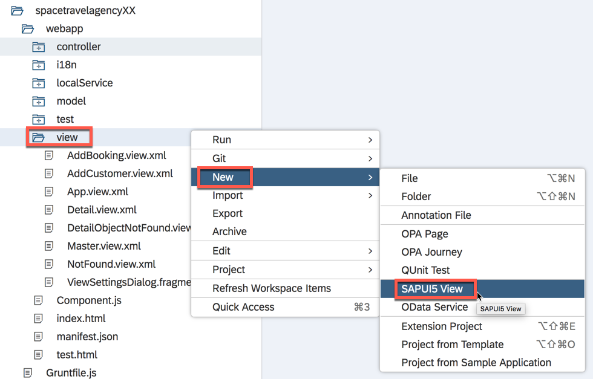
	
1. Type in ```Dashboard``` for the View Name.  Click on **Next**.

	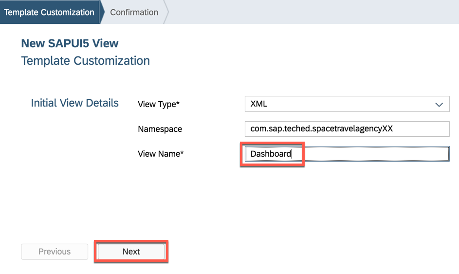

1. Click on **Finish**.

	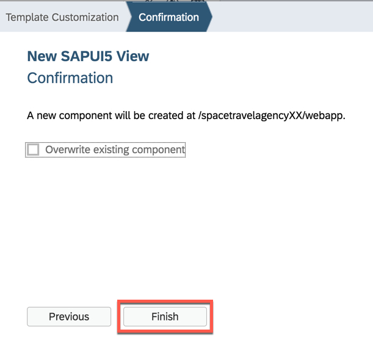

1. Open **Dashboard.view.xml** file. Replace with the following codes for the file.

	```
	<mvc:View xmlns:core="sap.ui.core" xmlns:mvc="sap.ui.core.mvc" xmlns="sap.m" xmlns:l="sap.ui.layout" xmlns:vbm="sap.ui.vbm"
		controllerName="com.sap.teched.spacetravelagencyXX.controller.Dashboard" xmlns:html="http://www.w3.org/1999/xhtml">
		<App>
			<pages>
				<Page title="Busiest Routes" showNavButton="true" navButtonPress="goBack">
					<content>
						<vbm:AnalyticMap id="vbi" width="100%" xmlns:l="sap.ui.layout" height="100%" regionClick="onRegionClick"
							regionContextMenu="onRegionContextMenu">
							<vbm:vos>
								<vbm:Routes items="{xsODataService>/AllAirportRoutes}">
									<vbm:Route position="{parts: [{path: 'xsODataService>LONGITUDE_START'},{path: 'xsODataService>LATITUDE_START'},{path: 'xsODataService>LONGITUDE_DEST'},{path: 'xsODataService>LATITUDE_DEST'}], formatter: '.formatter.formatRoutes'}" color="rgb(117,148,34)" colorBorder="rgb(255,255,255)" linewidth="3" routetype="Geodesic"
										click="onClickRoute" contextMenu="onContextMenuRoute"/>
								</vbm:Routes>
							</vbm:vos>
						</vbm:AnalyticMap>
					</content>
				</Page>
			</pages>
		</App>
	</mvc:View>
	```
	
1. Make sure you replace the **XX** text with your workstation ID. Press *\<Ctrl\>+f*. Search for **spacetravelagencyXX**. Replace **XX** text with your workstation ID, for example: **spacetravelagency88**. 


	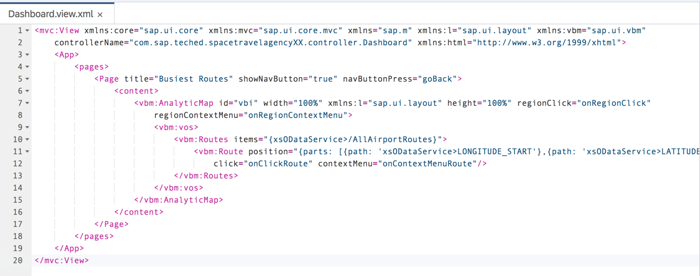
	

1. **Save** the file.

	

1. Then, we need to modify the Dashboard controller file.  Expand the *webapp > controller* folder. Open **Dashboard.controller.js** file. Replace with the following codes for the file.

	```
	sap.ui.define([
		"sap/ui/core/mvc/Controller",
		"sap/ui/core/routing/History",
		"sap/ui/model/json/JSONModel",
		"com/sap/teched/spacetravelagencyXX/model/formatter"
	], function (Controller, History, JSONModel, formatter) {
		"use strict";
		return Controller.extend("com.sap.teched.spacetravelagencyXX.controller.Dashboard", {
	
		formatter: formatter,
	
			goBack: function () {
				var oHistory = History.getInstance();
				var sPreviousHash = oHistory.getPreviousHash();
	
				if (sPreviousHash !== undefined) {
					window.history.go(-1);
				} else {
					var oRouter = sap.ui.core.UIComponent.getRouterFor(this);
					oRouter.navTo("object", true);
				}
			}
		});
	
	});
	```	
	
1. Make sure you replace the **XX** text with your workstation ID. Press *\<Ctrl\>+f*. Search for **spacetravelagencyXX**. Replace **XX** text with your workstation ID, for example: **spacetravelagency88**. 

  
		

1. **Save** the file.

	
	
1. Now, we need to adjust the **manifest.json** file for the datasource, targets, and routes to get Dashboard information. Please note this Dashboard consumes node.js service which is a different end point. That's the reason we need to create a new DataSource. Open the **manifest.json** file.

	

1. On the "Descriptor Editor", click on *Data Sources* tab.  Click on **+** button in the *OData Services* section.

	

1. On the Data Connection, select **Service URL**. Use the drop down selection to choose **462_XSODATA - 462 XSODATA For Dashboard**.

   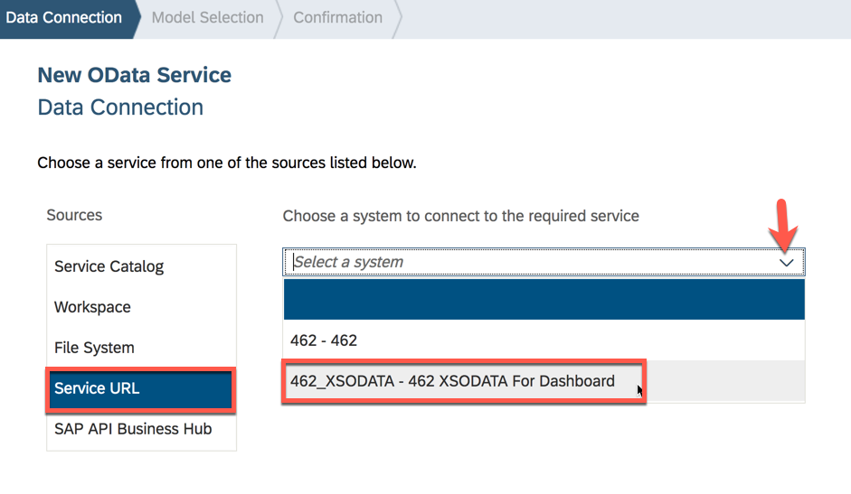
   
1. Type in ```/xsodata/allRoutes.xsodata/``` for the path. Click on **Test**.

   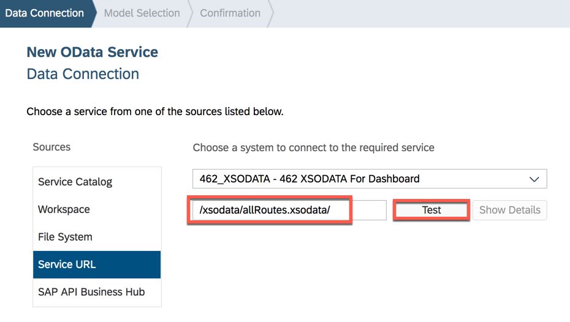
   
1. You will see the Service. Click on **Next**.

   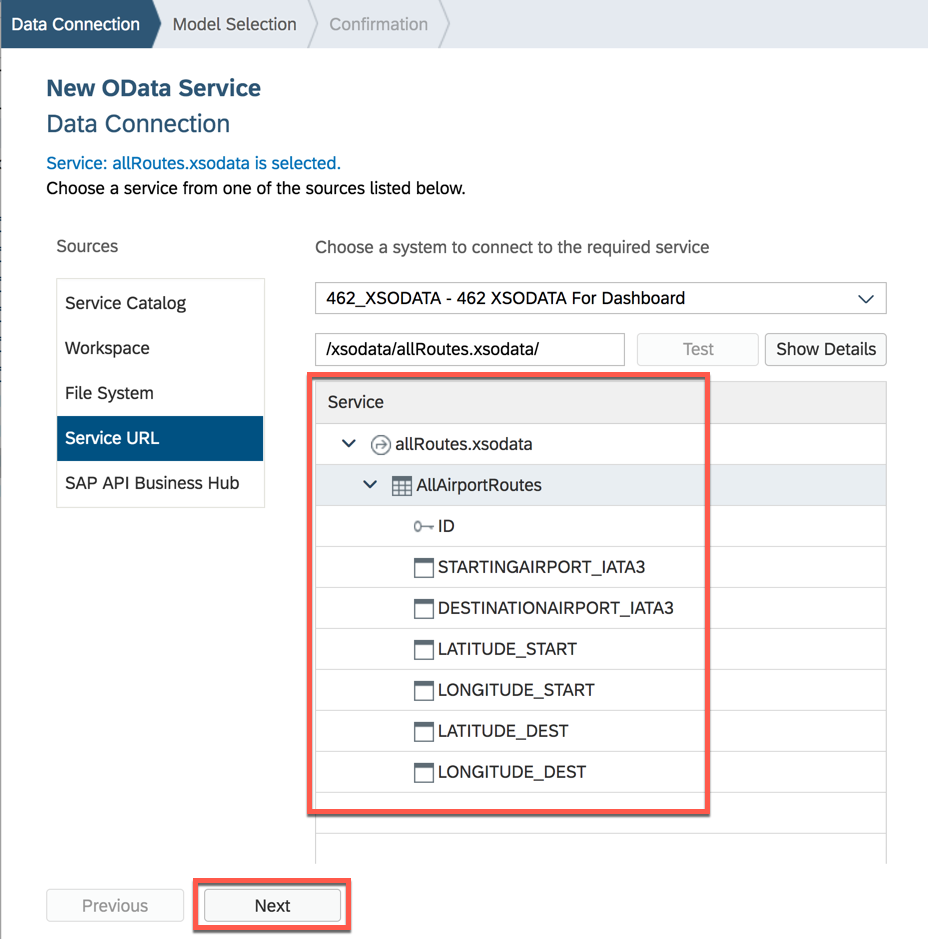
   
1. Choose **Create new model** button and type in ```xsODataService``` for Model Name. Click on **Next**.

   
   
1. Click on **Finish**.

   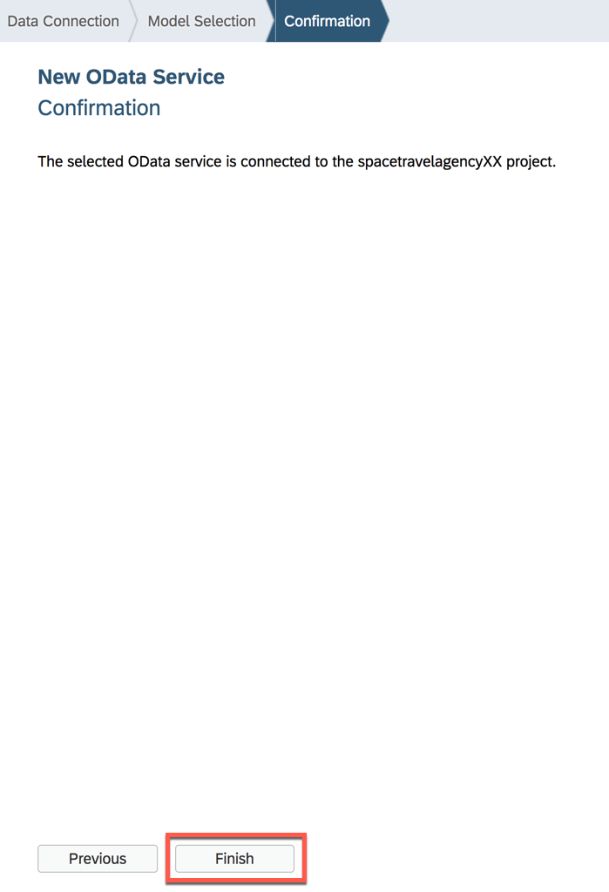 	

1. The new service has added.

   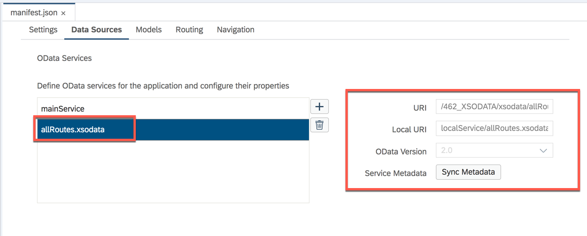 	
   
	
1. On the "Descrptor Editor", click on *Routing* tab.  Click on **Dashboard** in the *Manage Target* section.

	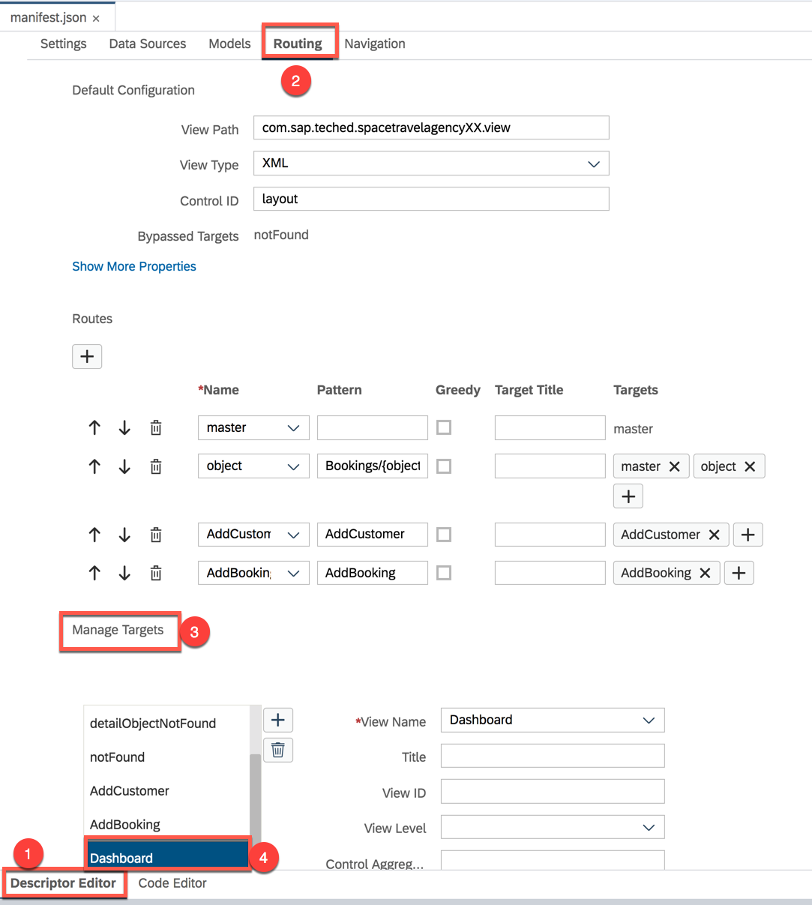
	
1. Enter the following inforamtion:

  	| Parameter | Value | Comments | 
	| --------- | ----------- |  ----------- | 
	| View Name    | **Dashboard** |    |
	| control Aggregation  | **midColumnPages** | |
	| control ID | **layout** | |  
  	| View Path | **com.sap.teched.spacetravelagencyXX.view** | (where **XX** is your workstation ID) |
  	| View Type    | **XML** | |   
  	| Transition   | **slide** |  |  
	| Clear Control Aggregation    | **false** | |   
	
	

   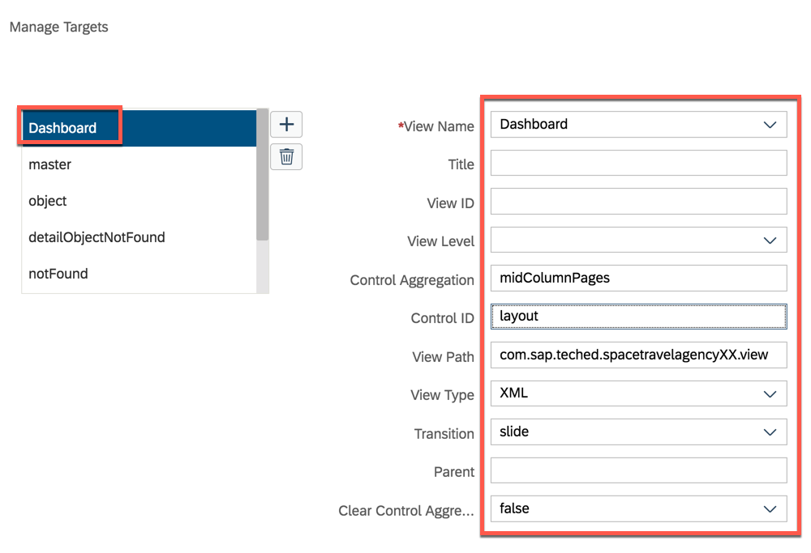
	
1. Click on **+** button in the *Routes* section.  

	
	
1. Add the following:

  	| Parameter | Value | 
	| --------- | ----------- | 
	| Name    | **Dashboard** |    
	| Pattern  | **Dashboard** | 
	| Targets | **Dashboard** |   
	

1. Route for Dashboard added.

	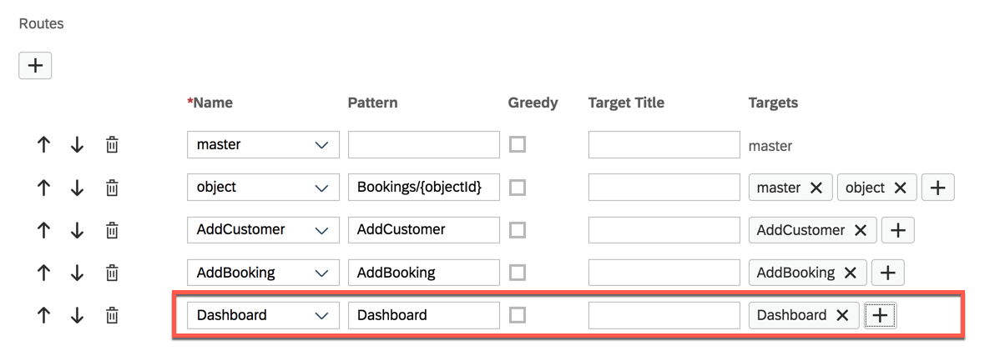


1. **Save** the file.

	
		
1. Next, we need to modify the format on the **formatter.js** file. Open the **formatter.js** file under *webapp > model* folder.

	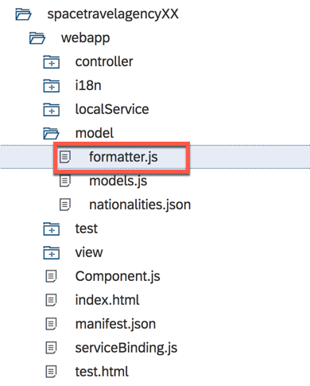

1. Replace the file with the following codes.

	```
	sap.ui.define([], function () {
		"use strict";
	
		return {
			/**
			 * Rounds the currency value to 2 digits
			 *
			 * @public
			 * @param {string} sValue value to be formatted
			 * @returns {string} formatted currency value with 2 digits
			 */
			currencyValue: function (sValue) {
				if (!sValue) {
					return "";
				}
	
				return parseFloat(sValue).toFixed(2);
			},
			dateFormat: function (sValue) {
				if (!sValue) {
					return "";
				}
	
				return sap.ui.core.format.DateFormat.getDateTimeInstance({
					pattern: "dd-MM-yyyy"
				}).format(sValue);
			},
			
			formatRoutes: function(longStart, latStart, longEnd, latEnd, ){
				return 	longStart +";"+ latStart + ";" + "0"+"; "+longEnd +";"+ latEnd + ";" + "0"; //"2.3533219;48.856614;0; -14.0034731;40.7143528;0"
			}
		};
	
	});
	```
		
		
	
	

1. **Save** the file.

	
	
1. Let's modify the Master View Booking title. Open the **i18n.properties** file under *webapp > i18n* folder. 

	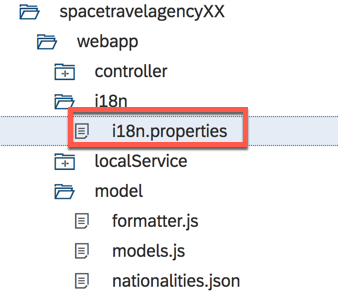

1. Replace the masterTitle Count with the folloring.
 
	```masterTitleCount=All Bookings ({0})``` 

	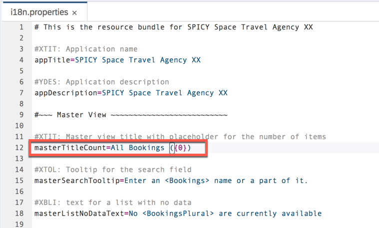

1. **Save** the file.

	

1. Run the preview.

	
			
1. Voila! The dashboard shows with the map and routes.  And the master title for booking updated.

	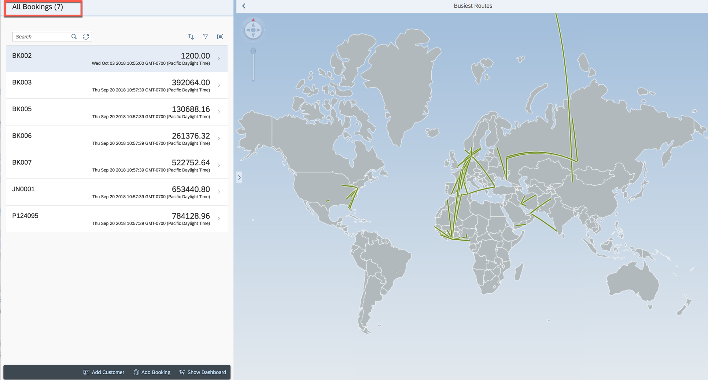
	
1. Congratualtions!  You have completed all exercises for this hands-on session.

	 


## Summary
This concludes the exercise. You should have learned how to add datasource from Node.js and create a dashboard for Booking. You have completed all exercises for **SAP TechEd 2018 - CNA462** hands-on session.

Back to [exercise index page](/././_excercise_/).
