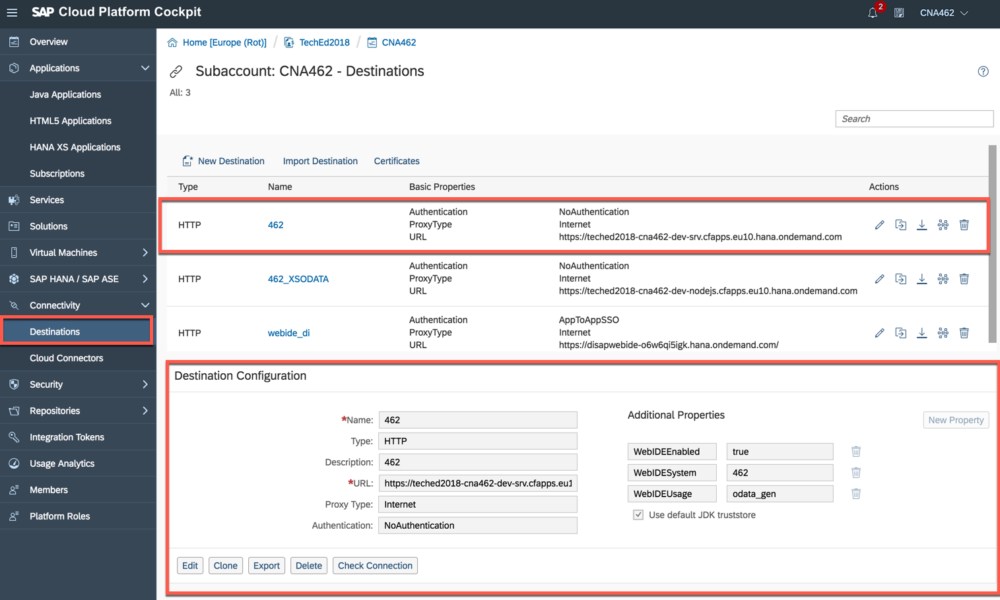

<table width=100% border=>
<tr><td colspan=2><h1>EXERCISE01 - Explain the landscape</h1></td></tr>
<tr><td><h3>SAP TechEd 2018 - CNA462</h3></td><td><h1> &nbsp;10 min</h1></td></tr>
</table>

## Description
In this exercise, you’ll learn how to access the cloud development landscape for the hands-on exercises

* Access SAP Cloud Platform Neo account
* And launch "SAP Web IDE Full-Stack" cloud development tool

For further reading on SAP Clould Platform, click here,
<https://cloudplatform.sap.com/index.html>

## Target group

* Developers
* People interested in building new solutions or extending SAP LoB Solutions using SAP Cloud Platform.

## Goal

The goal of this exercise is to learn about the SAP Cloud Platform cloud development resources and landscape we will use in this session.

## Prerequisites
  
Prerequisites for this exercise are given below.

* Browser.  
*Note: We recommand to use *Chrome* browser.

* For SAP TechEd 2018 we provide you with a full environment to develop this sample application. To run this hands-on excercise in your own environment you would need

1. SAP Cloud Platform Cloud Foundry Environment for runtime. 
1. SAP Cloud Platform Neo environment(for SAP Web IDE Full Stack)
1. SAP HANA DB
1. Destination Service on Cloud Foundry Environment

## Steps

1. [Exercise landscape](#exercise-landscape)
1. [Access SAP Cloud Platform Neo account](#access-neo)

###  Exercise landscape
This session focuses primarily on user interface development based on existing backend services that are already deployed for you. There are **two** services available for this landacpe. One from Java and another one from node.js.

* Service provided by Java
	- BookingService
	- FlightService
	
* Service provided by node.js
	- xsODataservice 

For the database model of the 2 services, please refer to the TechEd session [CNA262](https://github.com/SAP/cloud-sample-spaceflight-hana).
For Java service, please refer to the TechEd session [CNA376](https://github.com/SAP/cloud-sample-spaceflight-java).
The node.js service we are going to use for this session is based on a calculation view on top of our SAP HANA DB. If you are interested to develop business applications using node.js service please refer to TechEd session [CNA375](https://github.com/SAP/cloud-sample-spaceflight-node).

The database model, Java service, and node.js service are developed using *The Application Programming Model* via "SAP Web IDE Full-Stack" development tool.

### Access SAP Cloud Platform Neo account
You need SAP Cloud Platform Neo account to access "SAP Web IDE Full-Stack" and the destination for the services.

1.	Access SAP Cloud Platform Cockpit for Neo account via <http://bit.ly/sapcp462>. Please login with the **P_userid** provided by the instructors. Note the last 2 digits of this ID, this will be your workstation ID for the session. For example if your ID is P012497 the digits would be 97. Later in the excercise there will be a lots of references for **spacetravelagencyXX**, you will need to replace the XX with these 2 digits i.e. **spacetravelagency97** 

	 

1. After you have logged in, it will take you to the **Overview** page of the SAP Cloud Platform Cockpit for the Neo stack.

	

1.	From SAP Cloud Platform Cockpit, click on **Destination**. The destination **462** has configured to access the Java service.

	  

1.	The destination **462_XSODATA** has configured to access the Node.js service.

	
	
1.	From SAP Cloud Platform Cockpit, click on **Services**. Search for "SAP Web IDE Full-Stack" service.

	

1.	Access the "SAP Web IDE Full-Stack" service.  Click on the link of **Go to Service** to launch SAP Web IDE Full-Stack. The direct URL for this service is <http://bit.ly/webide462>.
   
	
	
1.	You are ready to use the development tool.

	 

## Summary
This concludes the exercise. By now you should know the excercise landscape for this hands-on exercise, how to access SAP Cloud Platform Neo account, check the destination setup, and launch SAP Web IDE Full-Stack.

Proceed with [next exercise](/././_excercise_/Exercise02/Exercise02.md).
